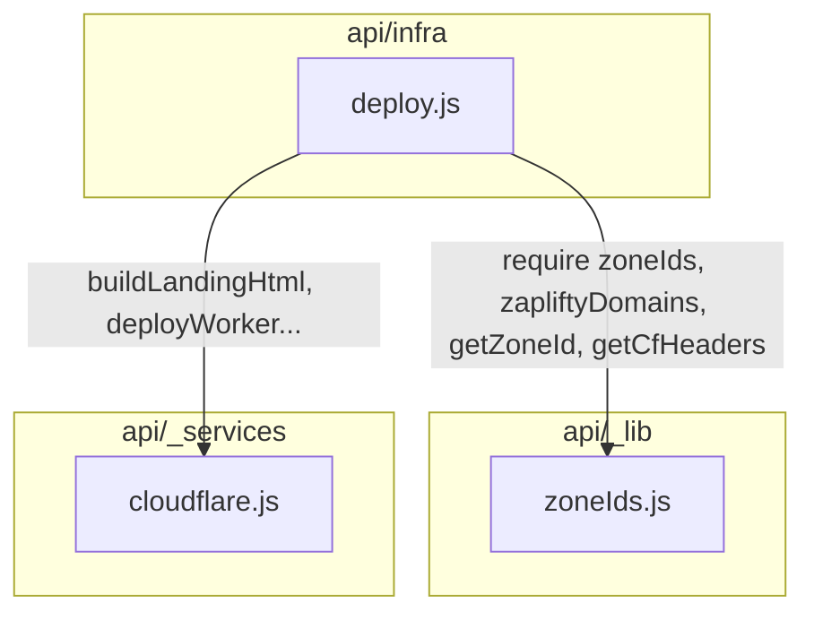

# Design Document: Deploy Template Fixes

## Overview

This design addresses four inter-related bugs in `api/infra/deploy.js`: template index collisions producing visually identical sites, blocking DNS calls causing timeouts on PATCH, swallowed htmlCache write errors returning false success, and a `zoneIds` map duplicated 3 times leading to inconsistencies. The fixes are surgical — a new shared module, a better hash function, fire-and-forget DNS, and proper error propagation.

## Architecture



## Components and Interfaces

### Component 1: `api/_lib/zoneIds.js` (NEW)

**Purpose**: Single source of truth for the domain→zoneId mapping and related helpers.

```javascript
// api/_lib/zoneIds.js

/**
 * Complete map of baseDomain -> env var name for Cloudflare zone IDs.
 * All endpoints reference this single object.
 */
const ZONE_IDS = {
  'verificaconta.com': process.env.CLOUDFLARE_ZONE_VERIFICACONTA,
  'validarfm.com': process.env.CLOUDFLARE_ZONE_VALIDARFM,
  // ... all domains consolidated here (superset of all 3 existing maps)
};

/**
 * Domains belonging to the zapliftyativos Cloudflare account.
 */
const ZAPLIFTY_DOMAINS = [
  'zapifyo9.com',
  'ativosfarmezaplify.com',
  'maycontexeira.com.br',
  'realfarmezaplify.com',
  'zaplifydigital0.com',
  'kikilt.com',
  'contasfmativo.com',
];

/**
 * Returns the zone ID for a given base domain, or empty string if not found.
 */
function getZoneId(baseDomain) {
  return ZONE_IDS[baseDomain] || '';
}

/**
 * Returns the correct Cloudflare API headers for a domain,
 * choosing the zapliftyativos token when appropriate.
 */
function getCfHeaders(baseDomain) {
  const isZaplifty = ZAPLIFTY_DOMAINS.includes(baseDomain);
  const token = isZaplifty
    ? (process.env.CLOUDFLARE_API_TOKEN_ZAPLIFTYATIVOS || process.env.CLOUDFLARE_API_TOKEN)
    : process.env.CLOUDFLARE_API_TOKEN;
  return {
    Authorization: `Bearer ${token}`,
    'Content-Type': 'application/json',
  };
}

module.exports = { ZONE_IDS, ZAPLIFTY_DOMAINS, getZoneId, getCfHeaders };
```

**Responsibilities**:
- Centralize all zone ID mappings (union of the 3 existing inline maps)
- Centralize zapliftyDomains list
- Provide `getZoneId()` lookup
- Provide `getCfHeaders()` to pick the correct API token per account

### Component 2: `computeTemplateIndex(domainName)` — in `api/_lib/zoneIds.js` or inline in deploy.js

**Purpose**: Deterministic hash producing a well-distributed template index (0–7) based primarily on `domainName`.

```javascript
/**
 * Compute a deterministic template index [0..7] for a domain.
 * Uses a simple string hash (djb2) on domainName for uniform distribution.
 * domainName is the primary entropy source — two different subdomains for
 * the same CNPJ will always get different layouts.
 */
function computeTemplateIndex(domainName) {
  let hash = 5381;
  for (let i = 0; i < domainName.length; i++) {
    hash = ((hash << 5) + hash + domainName.charCodeAt(i)) | 0; // hash * 33 + char
  }
  return Math.abs(hash) % 8;
}
```

**Why djb2**: It distributes short alphanumeric strings very well across small ranges. The current formula `(cnpjDigitSum * 7 + nameSeed * 3 + floor(updatedSeed / 1009)) % 8` fails because `cnpjDigitSum * 7` dominates and `updatedSeed / 1009` changes too slowly. djb2 uses every character with a multiplication factor, ensuring `"abc"` and `"abd"` map to different indices.

### Component 3: PATCH handler — DNS TXT as fire-and-forget

**Current problem**: The PATCH handler `await`s the DNS TXT POST to Cloudflare inside a `try/catch`. If Cloudflare times out (15s), the entire request stalls.

**Fix**: Remove the `await` — fire the request without blocking the response. Log errors in the `.catch()`.

```javascript
// BEFORE (blocking):
try {
  await axios.post(`https://api.cloudflare.com/client/v4/zones/${zoneId}/dns_records`, ...);
} catch (txtErr) { console.log(...); }

// AFTER (fire-and-forget):
axios.post(`https://api.cloudflare.com/client/v4/zones/${zoneId}/dns_records`, ...)
  .catch(e => console.log(`[PATCH-TXT] best-effort: ${e.response?.data?.errors?.[0]?.message || e.message}`));
```

This is safe because TXT records are idempotent and best-effort — the site works without them; they only enable Meta domain verification which can be retried.

### Component 4: PATCH handler — htmlCache write error propagation

**Current problem**:
```javascript
try {
  await prisma.$executeRawUnsafe(`UPDATE "Domain" SET "htmlCache" = $1 WHERE id = $2`, html, domain.id);
} catch (cacheErr) { console.log(`[PATCH] htmlCache update err: ${cacheErr.message}`); }
// ... then returns 200 OK regardless
```

**Fix**: Remove the local try/catch around the htmlCache write so that failures propagate to the outer catch block which returns 500.

```javascript
// No inner try/catch — let it throw
await prisma.$executeRawUnsafe(`UPDATE "Domain" SET "htmlCache" = $1 WHERE id = $2`, html, domain.id);
```

If this throws, the outer `catch (error)` at the top of the PATCH handler returns `res.status(500).json({ error: error.message })`.

## Data Models

No schema changes. The `Domain` model already has `htmlCache: String?`, `baseDomain: String?`, etc. No new columns needed.

## Key Functions with Formal Specifications

### Function: `computeTemplateIndex(domainName)`

```javascript
function computeTemplateIndex(domainName) // -> number [0..7]
```

**Preconditions:**
- `domainName` is a non-empty string (already validated upstream as `cleanSubdomain`)

**Postconditions:**
- Returns integer in range `[0, 7]`
- Same `domainName` always returns same index (deterministic)
- Different `domainName` values distribute uniformly across 0–7

### Function: `getZoneId(baseDomain)`

```javascript
function getZoneId(baseDomain) // -> string
```

**Preconditions:**
- `baseDomain` is a string (may be empty or unknown domain)

**Postconditions:**
- Returns the env var value if domain is in the map, or `''` otherwise
- No side effects

### Function: `getCfHeaders(baseDomain)`

```javascript
function getCfHeaders(baseDomain) // -> { Authorization: string, 'Content-Type': string }
```

**Preconditions:**
- `baseDomain` is a string

**Postconditions:**
- Returns headers object with correct token for the account owning that domain
- Falls back to primary token if zapliftyativos token is not set

## Example Usage

```javascript
// In deploy.js (top)
const { getZoneId, getCfHeaders, ZAPLIFTY_DOMAINS } = require('../_lib/zoneIds');
const { computeTemplateIndex } = require('../_lib/zoneIds');

// In get_site:
const fixedIndex = computeTemplateIndex(domain.domainName);

// In PATCH wildcard TXT section:
const zoneId = getZoneId(baseDom);
if (zoneId && cleanCode) {
  const cfHeaders = getCfHeaders(baseDom);
  axios.post(`https://api.cloudflare.com/client/v4/zones/${zoneId}/dns_records`,
    { type: 'TXT', name: domain.domainName, content: `facebook-domain-verification=${cleanCode}`, ttl: 1 },
    { headers: cfHeaders, timeout: 15000 }
  ).catch(e => console.log(`[PATCH-TXT] best-effort: ${e.message}`));
}

// htmlCache write — no inner try/catch:
await prisma.$executeRawUnsafe(`UPDATE "Domain" SET "htmlCache" = $1 WHERE id = $2`, html, domain.id);
```

## Error Handling

### DNS TXT call failure (PATCH)

**Condition**: Cloudflare API times out or returns 4xx/5xx
**Response**: Logged to console, request continues normally
**Recovery**: The TXT record can be retried via the existing `fix_txt` action or next PATCH

### htmlCache write failure (PATCH)

**Condition**: Prisma query fails (connection timeout, payload too large, etc.)
**Response**: Outer catch returns 500 with `{ error: "..." }` to operator
**Recovery**: Operator retries the PATCH; if persistent, investigate DB connection

### Unknown baseDomain in zoneIds

**Condition**: `getZoneId(baseDom)` returns `''`
**Response**: TXT creation is skipped (existing behavior preserved via `if (zoneId)` check)
**Recovery**: Add the domain to `ZONE_IDS` in `api/_lib/zoneIds.js`

## Correctness Properties

*Properties that should hold true across all valid executions of the fixed system.*

### Property 1: Template index determinism

*For any* domain name string, calling `computeTemplateIndex` multiple times SHALL always return the same integer value.

**Validates: Bugfix 2.1, 2.5**

### Property 2: Template index distribution

*For any* set of 8 or more distinct domain name strings of typical subdomain length (5–20 alphanumeric chars), `computeTemplateIndex` SHALL map them to at least 4 distinct template indices (i.e., no extreme clustering).

**Validates: Bugfix 2.1, 2.5**

### Property 3: Template index range

*For any* non-empty string input, `computeTemplateIndex` SHALL return an integer in the inclusive range [0, 7].

**Validates: Bugfix 2.1, 2.5**

### Property 4: Zone ID lookup consistency

*For any* base domain string, `getZoneId` SHALL return the same value as directly accessing `ZONE_IDS[baseDomain]` (or `''` if not present), ensuring the centralized map is functionally equivalent to the previous inline maps.

**Validates: Bugfix 2.4**

### Property 5: htmlCache write failure propagation

*For any* PATCH request where the htmlCache database write throws an error, the endpoint SHALL return HTTP 500 (not 200) to the caller.

**Validates: Bugfix 2.3**

### Property 6: DNS TXT non-blocking

*For any* PATCH request to a wildcard domain, the response SHALL be returned to the caller without waiting for the DNS TXT Cloudflare API call to complete.

**Validates: Bugfix 2.2**
